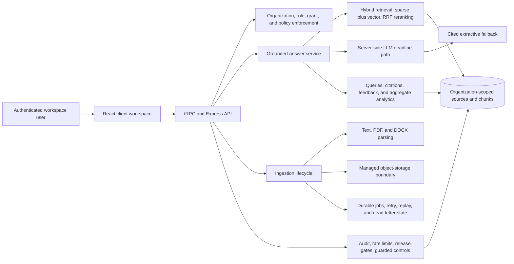

# NEXUS RAG architecture overview

## Scope

This document describes the **GitHub source package** as delivered. It maps the implemented application components and their controlled boundaries. It does not represent a hosted deployment, a configured Google Cloud service, or approval to process sensitive production data.

## Component map

The client supplies the evidence-first workspace, while server procedures enforce the organization and collection scope. Retrieval is never treated as permission on its own: the request must first satisfy authentication, role, collection-grant, and policy checks.

## Repository layout

| Area | Primary paths | Responsibility |
| --- | --- | --- |
| Workspace UI | `client/src/pages/` | Chat, sources, collections, evaluation, and control-plane experiences |
| Server entry and routing | `server/_core/`, `server/routers.ts` | Express runtime, authenticated request context, tRPC routing, route guards |
| Domain services | `server/nexus/service.ts` | Organization-scoped business rules, governance, ingestion, source management, and guarded Phase 4 procedures |
| Retrieval | `server/nexus/retrieval.ts` | Sparse/vector candidate selection, reciprocal-rank fusion, exact-token safeguards, and scoped evidence selection |
| Quality evaluation | `server/nexus/goldenEvaluation.ts`, `docs/qa/` | Golden corpus, retrieval, faithfulness, abstention, and latency evidence |
| External API boundary | `server/nexus/api.ts` | Versioned read-only bearer query endpoint and scoped API-key enforcement |
| Schema and migrations | `drizzle/schema.ts`, `drizzle/` | MySQL/TiDB-compatible data model and ordered migration history |
| Tests | `server/**/*.test.ts` | Retrieval, route guards, tenant isolation, SSO, API keys, connectors, and analytics coverage |

## Query and answer flow

| Step | Control or behavior |
| --- | --- |
| 1. Scope request | The authenticated organization, member role, collection grants, and active policies constrain candidate evidence. |
| 2. Retrieve evidence | Hybrid sparse and vector retrieval produce candidates, which are reranked with reciprocal-rank fusion and exact-token safeguards. |
| 3. Admit or abstain | If evidence is insufficient or fails relevance safeguards, the system returns an explicit no-answer response rather than inventing support. |
| 4. Generate grounded answer | The server-side LLM path receives admitted evidence and is bounded by a deadline. |
| 5. Preserve answerability | On deadline or generation failure, a citation-complete extractive fallback preserves a supported response where possible. |
| 6. Persist trace | Queries, citations, feedback, and aggregate-only analytics support evaluation and governance without raw-prompt analytics retention. |

## Ingestion and recovery flow

Source intake accepts pasted text, URLs, and supported uploaded documents. The ingestion path records source metadata and state transitions, stores binary data through the storage boundary, extracts content from PDF and DOCX documents where applicable, chunks the parsed material, and records durable job status. Retry, replay, and dead-letter state are modeled in the source package; the post-publication scheduler activation remains deliberately inactive.

| State concern | Source-package behavior | Activation status |
| --- | --- | --- |
| Binary data | Stored through the managed object-storage abstraction | Implemented boundary; external replacement not configured |
| Parsing | Text, PDF, and DOCX extraction | Implemented and tested through application flows |
| Job recovery | Durable retry/backoff, replay, and dead-letter status | Implemented; external worker remains inactive |
| Scheduled retry | Existing route is limited to a managed cron identity | Deferred; do not expose it to an external scheduler without the documented adaptation |

## Security and governance boundaries

Organization scope is a server-enforced boundary. The source package persists memberships, roles, collection grants, invitations, policies, audit records, rate-limit controls, and release-gate decisions. Phase 4 functionality—SSO readiness, scoped service keys, governed connector drafts, and aggregate-only analytics—is implemented in guarded form. It is not a directive to activate an identity provider, connector sync, API client, or sensitive-data workflow.

| Boundary | Implemented source behavior | Required before any future activation |
| --- | --- | --- |
| Tenant isolation | Organization-scoped query paths, integration coverage, and automatic test cleanup | Preserve test evidence and review access-control changes |
| Service API keys | Scoped read-only query access, quota, rotation, revocation, and audit trail | Owner approval and production API-client review |
| SSO readiness | Draft configuration, verified-domain policy, role mapping, and blocked enforcement | External IdP configuration plus qualified security review |
| Connectors | Collection-scoped drafts and blocked sync lifecycle | Provider-specific review, provenance checks, and owner approval |
| Analytics | Aggregate-only organization metrics without raw prompt/content retention | Privacy and production review |

## Quality and evidence records

The source package includes public, non-sensitive CISA/NIST corpus evidence. The isolated 20-case evaluation recorded **88.5% precision@5**, **90.6% recall@10**, **93.8% faithfulness**, **100% abstention**, and **3,551 ms p95 latency**. These results verify the public-corpus release gate; they are not a claim of readiness for customer or sensitive data.

| Evidence | Location | Use |
| --- | --- | --- |
| Public-corpus evaluation | `docs/qa/public-corpus-evaluation-report.md` | Retrieval, faithfulness, abstention, latency, and cleanup evidence |
| Phase 4 verification | `docs/qa/phase-4-guarded-verification.md` | Guarded-control behavior and activation prerequisites |
| PRD phase alignment | `docs/architecture/prd-phase-gate-alignment.md` | Implemented scope versus remaining acceptance gates |
| External review package | `docs/operations/external-review-handoff.md` | Backup/restore, load/failure, and qualified security-review execution plan |
| Evidence ledger | `docs/operations/external-review-evidence-register.md` | Owner and reviewer sign-off record |

## Inactive external-hosting path

External hosting is intentionally outside this source-package handoff. The optional Google Cloud Run materials document a future design and keyless preflight boundary only; they do not create resources or deploy NEXUS RAG. Before any future hosting decision, replace the managed authentication, database, object storage, LLM, and scheduler dependencies with approved equivalents; validate them in non-production; and complete the documented backup/restore, load/failure, and qualified security-review gates.

See [LOCAL_DEVELOPMENT.md](LOCAL_DEVELOPMENT.md) for local source-package work, [CONTRIBUTING.md](../CONTRIBUTING.md) for change discipline, and [README.md](../README.md) for the high-level handoff and validation commands.
