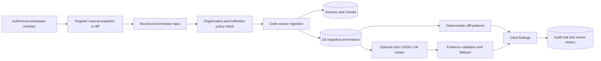

# Governed Git-intelligence architecture

## Purpose and boundary

NEXUS Git Intelligence converts an **owner-submitted repository snapshot or Git diff** into organization- and collection-scoped evidence. It is intentionally not a GitHub connector, repository-cloning agent, code executor, or credential vault. Repository references are optional metadata, validated to reject credentials, and no server-side Git command is exposed by this feature.

> Submitted code and diffs are untrusted data. They are bounded before storage, never executed, and never treated as instructions for the review model.

## Evidence flow

The registration path reuses NEXUS source ingestion so Git material can participate in normal scoped retrieval. The companion snapshot row records the source relationship, repository label, revision pair, snapshot kind, file count, and truncation state. It does not contain repository credentials or a clone location.

## Review contract

| Control | Implemented behavior |
| --- | --- |
| Authorization | Registration, history, and review begin with organization scope and require collection access. Viewers cannot submit or review content. |
| Input bound | Snapshot content is retained up to 120,000 characters; review input is capped at 50,000 characters. Truncation is persisted and shown to the reviewer. |
| Non-execution | The system does not run Git, clone a repository, fetch a URL, execute submitted code, or invoke shell commands from Git evidence. |
| Deterministic review | Exact added diff lines are inspected for a limited set of high-signal patterns, such as dynamic execution, raw HTML sinks, hard-coded credential shapes, type-safety suppression, and insecure HTTP. |
| Optional AI review | A server-side model receives only a bounded diff delimited as untrusted data and returns strict JSON. Findings are accepted only when the evidence is an exact excerpt of the submitted diff. |
| Failure mode | The deterministic review remains available if the model call times out, fails, or produces unusable structured output. The review run is marked `degraded`. |
| Traceability | Every retained finding includes severity, category, diff path/line where available, exact evidence, recommendation, engine, review run, snapshot, organization, and audit event. |

## Data model

| Record | Scope | Purpose |
| --- | --- | --- |
| `git_repository_snapshots` | Organization and collection | Links manual Git evidence to the indexed code source and preserves revision/provenance metadata. |
| `git_review_runs` | Organization and snapshot | Records review mode, completion/degraded status, input truncation, reviewer, and a concise summary. |
| `git_review_findings` | Organization, snapshot, and run | Stores only structured, evidence-backed findings with an exact submitted excerpt. |

The migration is additive (`drizzle/0010_tiresome_devos.sql`). It has no destructive operation and retains the same database review discipline as existing NEXUS schema changes.

## Operating guidance

Use Git Intelligence for an approved diff that the reviewer is authorized to place in a specific collection. Treat findings as review assistance, not a deployment approval, security certification, or proof that no defect exists. A source change that affects security, tenant isolation, or data handling still requires the repository's normal code review, regression validation, and deferred operational gates.

See [the working example](../examples/git-intelligence-example.md), [the architecture overview](ARCHITECTURE.md), and [the GitHub source handoff decision](../operations/source-handoff-decision.md).
